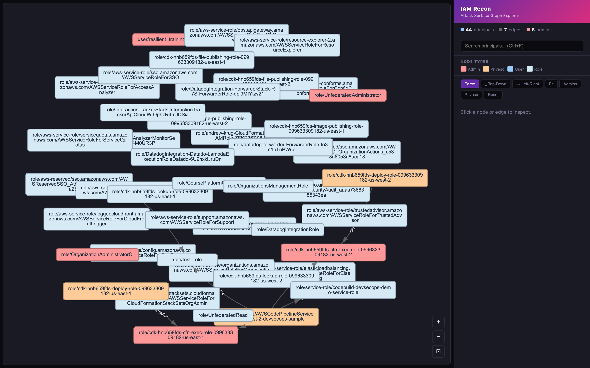
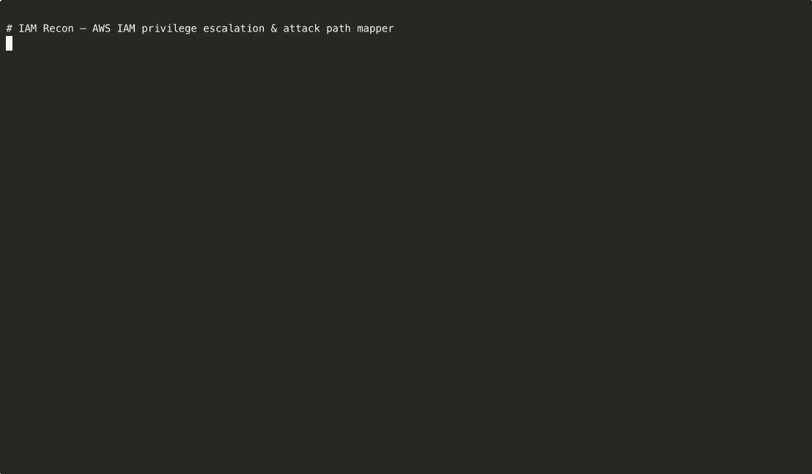

# IAM Recon

AWS IAM privilege escalation and attack path mapper. Builds a directed graph of IAM principals (users and roles), identifies privilege escalation vectors, and maps dangerous permissions to known attack paths.



*The interactive graph explorer — force-directed layout of a real 44-principal AWS account, with admin nodes in red, privesc-capable roles in orange, users in blue, and standard roles in light cyan.*

## Demo

CLI walk-through: `graph display` → `argquery --preset privesc` → `pathfinding` → `analysis`.



> The raw recording lives at [`docs/screenshots/demo.cast`](docs/screenshots/demo.cast). To replay
> it in a terminal: `asciinema play docs/screenshots/demo.cast`. You can also upload it to
> [asciinema.org](https://asciinema.org) with `asciinema upload docs/screenshots/demo.cast` for
> an interactive web-embedded player (see [asciinema embedding docs](https://docs.asciinema.org/manual/server/embedding/)).

## Inspired By

- **[PMapper](https://github.com/nccgroup/PMapper)** (NCC Group) -- the original Python IAM privilege escalation mapper, now abandoned. IAM Recon is a ground-up Rust rewrite of PMapper with full feature parity and significant enhancements.
- **[awspx](https://github.com/FSecureLABS/awspx)** (F-Secure) -- interactive graph visualization of AWS environments. The `--interactive-viz` browser-based graph explorer is inspired by awspx's Cytoscape.js approach.
- **[pathfinding.cloud](https://pathfinding.cloud)** (Datadog) -- comprehensive database of AWS privilege escalation paths. IAM Recon bundles all 66+ pathfinding.cloud paths at build time and automatically maps findings to known attack vectors with direct links.

## Features

- **IAM graph building** -- collects IAM data via AWS APIs, builds a directed graph of principals and privilege escalation edges
- **9 edge checkers** -- IAM, STS, Lambda, EC2, CodeBuild, CloudFormation, AutoScaling, SSM, SageMaker
- **Full IAM policy simulation** -- local evaluation of IAM policies with all condition operators, permission boundaries, SCPs, and resource policies
- **Natural language queries** -- `who can do iam:CreateUser with *`
- **Preset analyses** -- privilege escalation, wrong admins, service access mapping, endgame exposure, clusters
- **Pathfinding.cloud integration** -- automatically maps dangerous privileges to known escalation paths from [pathfinding.cloud](https://pathfinding.cloud) by Datadog
- **Interactive visualization** -- browser-based Cytoscape.js graph explorer with search, filter, and layout switching
- **Static graph export** -- DOT, SVG, PNG, PDF (via Graphviz), GraphML
- **Multiple output formats** -- text (colorized), JSON, CSV, OCSF (Open Cybersecurity Schema Framework)
- **TUI dashboard** -- full-screen terminal UI with module navigation
- **Offline mode** -- scan once while connected to AWS, query offline forever (API responses cached)
- **LLM-friendly output** -- `--compact` flag produces token-efficient output for AI agent consumption
- **Single binary** -- no Python, no dependencies, no Docker required

## Installation

### Homebrew (macOS, Linux)

This repository doubles as a Homebrew tap. Tap it with the explicit URL form,
then install:

```bash
brew tap andrewkrug/iam-recon https://github.com/andrewkrug/iam-recon
brew install andrewkrug/iam-recon/iam-recon
```

To upgrade later: `brew update && brew upgrade iam-recon`. The formula is
auto-regenerated by CI on every release and points at the matching binary for
your platform (macOS arm64/x86_64, Linux arm64/x86_64).

### Debian / Ubuntu (.deb)

`amd64` and `arm64` packages are attached to every release. Download and
install with `dpkg`:

```bash
# amd64
curl -fSL -o iam-recon.deb \
  https://github.com/andrewkrug/iam-recon/releases/latest/download/iam-recon_amd64.deb
sudo dpkg -i iam-recon.deb

# arm64 — same URL with iam-recon_arm64.deb
```

### Pre-built binaries

Download from [Releases](https://github.com/andrewkrug/iam-recon/releases) for:
- Linux x86_64 / aarch64
- macOS x86_64 (Intel) / aarch64 (Apple Silicon)

### From source

```bash
git clone https://github.com/andrewkrug/iam-recon.git
cd iam-recon
make install
```

## Quick Start

```bash
# Scan an AWS account (caches all data for offline use)
iam-recon graph create --profile myprofile

# Query the graph offline
iam-recon --account 123456789012 query "who can do iam:CreateUser"

# Run full security analysis
iam-recon --account 123456789012 analysis

# Map to pathfinding.cloud attack paths
iam-recon --account 123456789012 pathfinding

# Launch interactive graph explorer
iam-recon --account 123456789012 visualize --interactive-viz

# TUI dashboard
iam-recon --tui --account 123456789012

# Export for evidence
iam-recon --account 123456789012 visualize --format svg
iam-recon --account 123456789012 analysis --format csv -o findings.csv
iam-recon --account 123456789012 analysis --format ocsf -o findings_ocsf.json
```

## Output Formats

| Format | Flag | Use Case |
|--------|------|----------|
| Text (colorized) | default | Terminal reading |
| Text (compact) | `--compact` | LLM/AI agent consumption |
| JSON | `--format json` | Programmatic processing |
| CSV | `--format csv` | Spreadsheets, SIEM import |
| OCSF | `--format ocsf` | Security data lakes (Amazon Security Lake, Splunk) |
| SVG/PNG/PDF | `--format svg\|png\|pdf` | Evidence artifacts, reports |
| DOT | `--format dot` | Graphviz processing |
| GraphML | `--format graphml` | Graph analysis tools |

## Make Targets

```
make                    Show all targets
make build              Debug build
make release            Optimized release build
make test               Run all tests
make bench              Run Rust benchmarks
make bench-compare      Compare Rust vs Python (Docker)
make install            Install to ~/.cargo/bin
make tui                TUI dashboard
make interactive        Browser graph explorer
make analysis           Security analysis
make pathfinding        Pathfinding.cloud mapping
make privesc            Privilege escalation paths
```

## Required AWS Permissions

IAM Recon needs read-only access. See `required-permissions.json` for the minimal IAM policy.

## Architecture

```
iam-recon/src/
  model/          Core types (Node, Edge, Policy, Graph, Finding)
  policy_eval/    IAM policy simulation engine (conditions, wildcards, SCPs)
  edges/          9 privilege escalation edge checkers
  gathering/      AWS API data collection + offline cache
  querying/       BFS path finding, authorization queries, presets
  analysis/       Security findings generation
  pathfinding/    pathfinding.cloud integration (bundled at build time)
  visualization/  DOT, GraphML, interactive Cytoscape.js
  tui/            Terminal UI dashboard
  cli/            Clap CLI with all subcommands
```

## License

Apache License 2.0. See [LICENSE](LICENSE).
